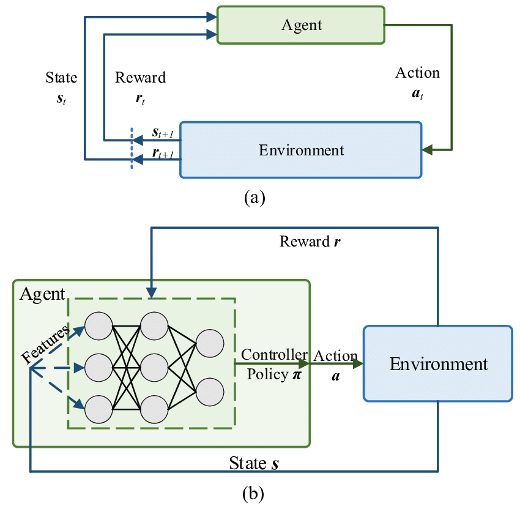

# Basteln-DroneAI
Drone Control but RL model instead of C++ PID control

Here's a how to train, optimize, and deploy a reinforcement learning (RL) model for a drone on an RP2040, while keeping 3D visualization with PyBullet, and excluding AKS.

1. Train the Model (Azure ML or Locally)
    Use Proximal Policy Optimization (PPO) with a lightweight neural network (e.g., 32-32 layers).
    Simulate drone flight in PyBullet for 3D visualization.
    Train the agent using Stable-Baselines3.

2. Convert Model to TensorFlow Lite (TFLite)
    Convert the trained RL model to TFLite for deployment on RP2040.

3. Optimize Model for RP2040 (Quantization)
    Reduce model size and improve performance by quantizing (INT8).

4. Deploy to RP2040
    Install TinyML runtime and copy ppo_drone_quantized.tflite to RP2040.
    Run inference on MicroPython to predict drone movements.

# ML

|    approx_kl            low value indicates not making dramatic changes
|    clip_fraction        should be low, ideally around 0.1 to 0.3
|    clip_range           0.2 is a common
|    entropy_loss         decrease slowly
|    explained_variance   positive and increase over time, close to 1
|    learning_rate        
|    loss                 decrease over time
|    n_updates            
|    policy_gradient_loss should steadily decrease, less negative
|    std                  
|    value_loss           decrease over time

#